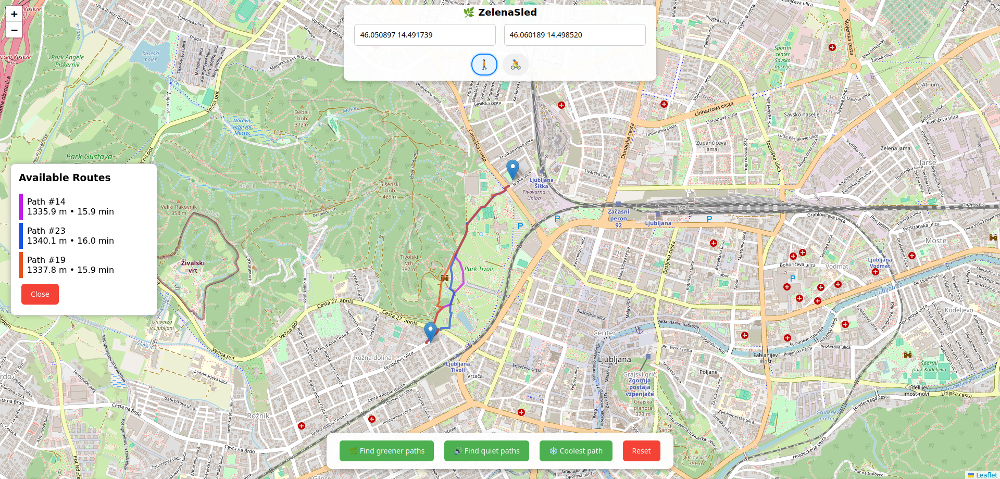

# ZelenaSled
App for planning green, cool and quiet routes in Ljubljana 

# 🌱 Zelena Sled

**Zelena Sled** is a route planning app based on Django that helps pedestrians and cyclists in Ljubljana find greener, cooler and quieter paths. By considering vegetation, temperature and noise levels, it aims to improve well-being and reduce exposure to harmful urban conditions while promoting sustainable mobility.

---

## 👩‍💻 Authors

- **Iva Černoša** – Data processing, backend development, routing algorithms, documentation
- **Anja Ostovršnik** – Frontend development, UI/UX design, temperature model
- **Anja Hrvatič** – Data and methology research, sourcing noise dataset, presentation for hackathon

---

🔧 _This project was developed as part of the **Arnesov Vseslovenski HackathON 2025**._

---

## 🌿 About the App

In urban environments like Ljubljana, people who choose eco-friendly travel options such as walking or cycling are often exposed to air pollution, noise pollution, heat, strong sun, and a lack of green spaces. These environmental factors can worsen health conditions, reduce quality of life, and increase mortality, especially during heatwaves.

While green areas have been proven to improve well-being and reduce stress, noise, and pollution exposure, existing navigation apps rarely consider these important environmental and health-related factors.

Our app aims to fill that gap by planning **greener, cooler and quiter walking and cycling routes** in Ljubljana. By creating a **smart route planning system**, we offer users healthier and more pleasant paths—balancing efficiency with well-being.


🧭 **Routing Explanation**  
All routing is based on network graphs for bikes and pedestrians in Ljubljana, downloaded from OpenStreetMaps (fetched using this Python [script](https://github.com/iva-c/ZelenaSled/blob/7d6712204207def0e291f0b6f10d1ab337349aca/Cycle_walking_graphs_lj.ipynb)) using a [bounding box](https://github.com/iva-c/ZelenaSled/tree/main/ZelenaSled/routing/data/ljubljana_bounding_box.csv) for Ljubljana as defined by OpenStreetMaps.

The app generates **25 shortest simple paths** between two location points using NetworkX.  
- If no routing preferences are selected, the top **3 shortest paths** are returned.  
- If preferences are selected, the top **3 optimal paths** are returned based on the chosen criteria.

There are **three routing preferences**:  
- 🌿 **Vegetation**: Paths are ranked based on the **Normalized Difference Vegetation Index (NDVI)** within **H3 hexagons (resolution 13)** that the path crosses.  
- 🔇 **Noise**: Paths are ranked based on the **average noise level** along the route, using spatial polygons with noise level data.  
- 🌡️ **Temperature**: Paths are ranked based on **Land Surface Temperature (LST)**, calculated from thermal satellite imagery and averaged within **H3 hexagons (resolution 13)** to prioritize cooler routes.


---

## 📊 Methodology

### NDVI – Vegetation Score

Normalized difference vegetation index (NDVI) was computed from **Sentinel-2’s Red and Near-Infrared (NIR) bands** ([script](https://github.com/iva-c/ZelenaSled/blob/f7d817477e1ad724063e4ad3278c4420edbbc067/analize/NDVI_by_H3.ipynb)). The [satellite data](https://download.dataspace.copernicus.eu/odata/v1/Products%2810164c43-3e57-4e32-a579-2cb6b8d93bea%29/%24value) (10m resolution, dated 19.7.2022) was downloaded from the **Copernicus Browser**, selected for its low cloud coverage (<5%) and rich summer vegetation.

We calculated the average NDVI values within **H3 hexagons at resolution 13** across the Ljubljana bounding box and stored them in a [JSON file](https://github.com/iva-c/ZelenaSled/blob/main/ZelenaSled/routing/data/avg_ndvi_h3_13.zip) (unzipped automatically on first Django `runserver`). This enables us to compute a path’s vegetation score by averaging the NDVI values of the hexagons it intersects, using the function [`get_top_3_ndvi`](https://github.com/iva-c/ZelenaSled/blob/main/ZelenaSled/routing/views.py), and return the **3 greenest paths**.

### Noise – Quietness Score

Noise data was downloaded from [Noise-Planet Data](https://data.noise-planet.org/noisecapture/). We used the [`*.areas.geojson`](https://github.com/iva-c/ZelenaSled/blob/main/ZelenaSled/routing/data/Slovenia_Osrednjeslovenska_Ljubljana.areas.geojson) file, which contains **aggregated community noise measurements** in hexagonal areas (15 m radius). For our quiet path ranking, we use **LA50** values, as it more robustly reflects typical ambient noise levels than LAeq, which can be skewed by brief loud events.

The app uses **Shapely** to efficiently compute intersections between path segments and noise tracks. This allows us to calculate an average noise score for each path using the function [`get_top_3_quietest_paths`](https://github.com/iva-c/ZelenaSled/blob/main/ZelenaSled/routing/views.py), as demonstrated in this [exploratory script](https://github.com/iva-c/ZelenaSled/blob/f7d817477e1ad724063e4ad3278c4420edbbc067/analysis/average_noise_path.ipynb).

To ensure valid evaluation, a path must have **at least one noise measurement per 500 meters**. The **3 quietest paths** out of the initial 25 shortest paths are returned if the user selects the noise preference.

### Temperature – Heat Exposure Score

Land Surface Temperature (LST) was estimated using **Landsat 8 satellite data**, specifically from the **Thermal Infrared Sensor (TIRS) Band 10**. LST represents the temperature of the Earth’s surface and is derived from **thermal infrared radiation** detected by the satellite. For a reliable snapshot, we selected a **cloud-free image from July 17, 2024**, during peak summer conditions. LST values were calculated using standard radiometric conversion formulas, transforming the raw satellite data into temperature values.

To integrate heat exposure into the app, we averaged LST values within **H3 hexagons at resolution 13**, covering the city of Ljubljana. These values were stored in a [JSON file](https://github.com/iva-c/ZelenaSled/blob/main/ZelenaSled/routing/data/avg_ndvi_h3_13.zip) (automatically extracted during setup). Similar to vegetation and noise, each path’s **heat score** is computed by averaging the temperature of intersecting hexagons using the same function [`get_top_3_ndvi`](https://github.com/iva-c/ZelenaSled/blob/main/ZelenaSled/routing/views.py), just different input. This enables users to choose **cooler paths** during hot weather, based on urban heat patterns.


---

## 🚫 Bounding Box Limitation

The Zelena Sled app only returns routes **within the [Ljubljana bounding box](https://github.com/iva-c/ZelenaSled/tree/main/ZelenaSled/routing/data/ljubljana_bounding_box.csv)**. If the starting or destination point is outside this area, no route is returned.

---


### 🖼️ Example Route Preview

We use **[Leaflet](https://leafletjs.com/)** to visualize geospatial data 





---


## 🚀 Running the App Locally

To run the **ZelenaSled** Django app locally, follow these steps:

### 1. Clone the repository

```bash
git clone https://github.com/iva-c/ZelenaSled.git
cd ZelenaSled
```

### 2. Create a virtual environment and install dependencies

It's recommended to use a virtual environment:

```bash
python -m venv venv
source venv/bin/activate  # On Windows use: venv\Scripts\activate
pip install -r requirements.txt
```

### 3. Apply migrations and collect static files

```bash
python manage.py migrate
python manage.py collectstatic
```

### 4. Run the development server

```bash
python manage.py runserver
```

### 5. Start planing paths

🌍 Open your browser and head to [http://127.0.0.1:8000/](http://127.0.0.1:8000/) — your greener, cooler, quieter journey through Ljubljana starts here!
